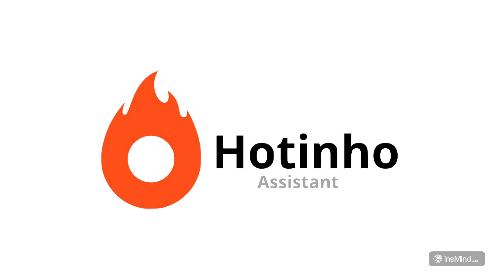
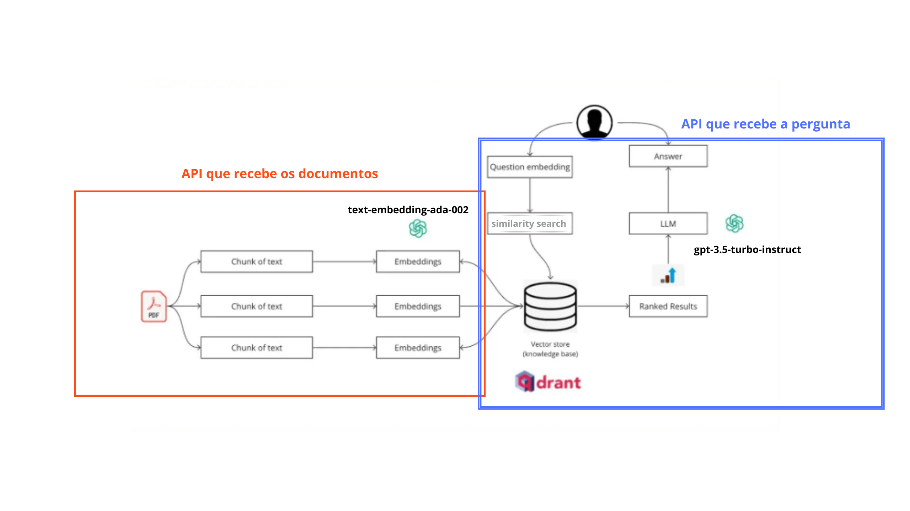
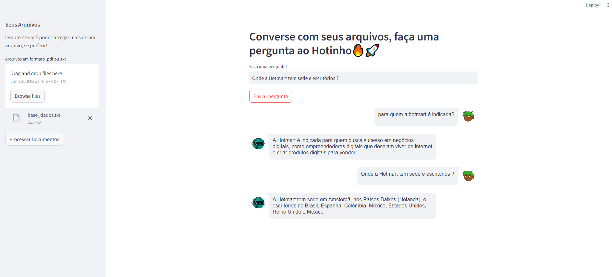
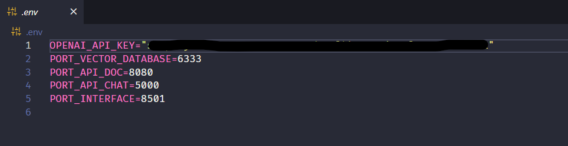
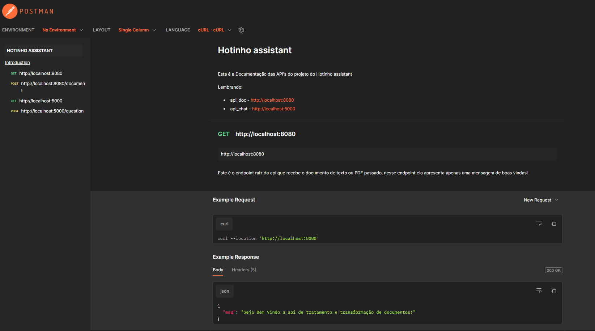

<div align="center">
  <h1 align="center">
    <br />
    <br />
    
  </h1>
</div>

## Introdução 📖

* Hotinho é um projeto desenvolvido para o processo seletivo de machine learning engineer da Hotmart.

* Ele consiste em um assistente que baseado nos documentos textos que são enviados para o mesmo, consegue responder perguntas sobre os demais assuntos presentes no documento enviado.

* Para criação do projeto foi necessário a construção de duas APIs, a utilização de um Vector Database open-source (Qdrant) e a criação de uma interface amigável para usuários, que se comunica com cada uma das APIs.

* Cada uma das APIs criadas possui uma função específica dentro da arquitetura do projeto.

    - A primeira API recebe documentos (.txt ou .pdf), processa esses documentos, quebra eles em chunks e transforma os chunks em embeddings, para armazenar no Vector Database open-source usado no projeto, o Qdrant.

    - A segunda API recebe uma pergunta através de uma requisição, processa essa pergunta, transforma ela em um embedding e realiza uma busca através de similaridade do cosseno dos embeddings mais similares que estão armazenados no nosso Vector Database. Dessa maneira, ela vai enviar para o LLM a pergunta e o contexto necessário, assim o LLM irá responder a pergunta com base naquele contexto.

* O modelo de embedding usado no projeto foi o 'text-embedding-ada-002' da OpenAI e o LLM usado foi o 'gpt-3.5-turbo-instruct' também da OpenAI. Com isso já tenha em mente que para rodar o projeto no seu computador será necessário gerar uma api-key no site https://platform.openai.com/api-keys

<div align="center">
  <h1 align="center">
    Arquitetura do Projeto⛏️⚙️
    <br />
    <br />
    
  </h1>
</div>

* Fica visível que cada API tem um determinado papel na arquitetura do projeto, e cada uma delas se conecta com o nossa coleção dentro do Vector Database, seja para armazenar os embeddings dos arquivos enviados ou para buscar os embeddings mais similares a uma pergunta enviada.

<div align="center">
  <h1 align="center">
    Interface do Hotinho🔥🚀
    <br />
    <br />
    
  </h1>
</div>

## Instruções para uso do projeto 👨‍💻
Para utilização do projeto na sua máquina será necessário realizar alguns passos:

* O primeiro e mais importante de todos os passos é criar um arquivo nomeado (.env) na raiz do projeto. Com isso, você irá setar importantes variáveis de ambiente que são necessárias para definir as portas das aplicações e também a sua api-key da OpenAI. O arquivo deve conter as seguintes informações:
<div align="center">
  <h1 align="center">
    .env📁
    <br />
    <br />
    
  </h1>
</div>


Conteúdo do arquivo .env:
```
  OPENAI_API_KEY="sua_api_key"
  PORT_VECTOR_DATABASE=6333
  PORT_API_DOC=8080
  PORT_API_CHAT=5000
  PORT_INTERFACE=8501
```
* Observação Importante: Se atente a manter os mesmos nomes e portas das variáveis de ambiente apresentadas na imagem acima, pois essas nomenclaturas estão sendo referenciadas dentro dos códigos do projeto. 

* Após a criação do arquivo .env, você irá abrir o terminal do seu computador no diretório do projeto e setar o seguinte comando:

```
docker-compose build
```  
Esse comando é o responsável por realizar o build de todas as imagens docker das nossas aplicações, lembrando que esse processo pode demorar alguns minutinhos.
* Após rodar o 'docker-compose build', será necessário você setar mais um comando:
```
docker-compose up
```  
Esse comando é o responsável por criar e instanciar todos os containers das nossas aplicações.

Com isso, teremos tudo pronto para poder testar as nossas APIs e o Vector Database, assim como, testar a nossa interface que conecta toda a arquitetura do projeto em uma aplicação amigável para usuários.

```
Qdrant -> http://localhost:6333/dashboard
api_doc -> http://localhost:8080/document
api_chat -> http://localhost:5000/question
interface_Hotinho -> http://localhost:8501
```  
Aqui está os endereços e endpoints que você irá visualizar no seu browser (como no caso do Qdrant e da aplicação de interface do Hotinho) ou os endereços das API's que você usará para testar no POSTMAN, caso prefira!
## Testes e Reprodutibilidade🧪
Sobre testes e documentação das API's, abaixo segue um link onde é possível visualizar como fazer as requisições e reproduzi-las dentro do POSTMAN ou em outro software de sua preferência.

Click no link abaixo!

https://documenter.getpostman.com/view/22340062/2sA3XWdepf
<div align="center">
  <h1 align="center">
    Documentação e Exemplos das API's📁
    <br />
    <br />
    
  </h1>
</div>


## Melhorias futuras🔥🚀
* Embora o projeto seja uma abordagem poderosa, tem algumas limitações. Uma dessas limitações é a incapacidade de preservar o histórico da conversação. Cada pergunta é tratada de forma independente e o modelo não tem acesso a perguntas ou respostas anteriores. Mas isso é algo possível de melhorar dentro do projeto;

* Outra melhoria interessante é dar ao usuário a possibilidade dele criar novas collections dentro do nosso Vector Database. Pois, no projeto atual ele adiciona todos os embeddings dentro de uma mesma collection chamada 'documentos_collection'. Porém, podemos fazer com que as API's tenham mais endpoints, construindo endpoints de criação e deleção de collections, assim, montando diversas bases de conhecimentos diferentes e específicas para determinados temas;

* Dar a possibilidade do cliente escolher quais os modelos ele quer que sejam usados no processo de resposta. No projeto estamos usando soluções da OpenAI ('gpt-3.5-turbo-instruct'), então daria pra fazer com que as API's recebessem nas requisições qual o modelo selecionado (GPT-4 Turbo, GPT-4o, ....) pelos usuários e usar essa informação dentro do código;

* Criar template de prompts mais eficazes do que só passar a pergunta para o LLM, fazendo com que a interpretação e a resposta sejam cada vez mais assertivas;

* Por fim, seria interessante também a utilização de algum método adequado e eficaz de avaliação da nossa RAG, fazendo com que se tenha um ciclo de interação, feedback e adaptação.
